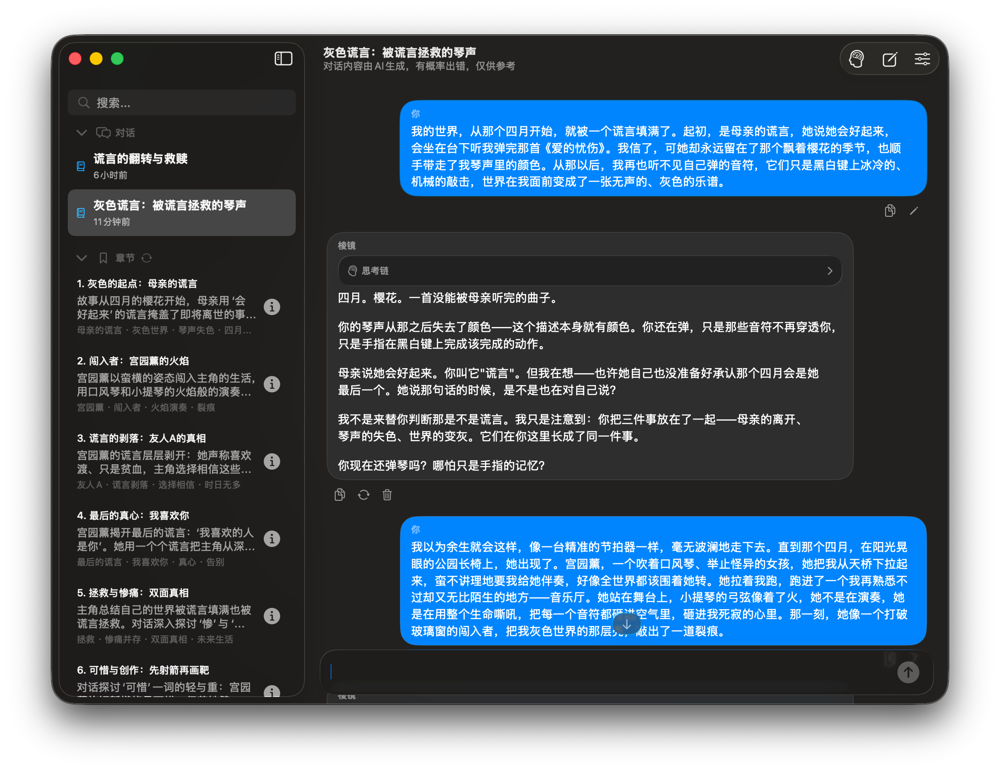
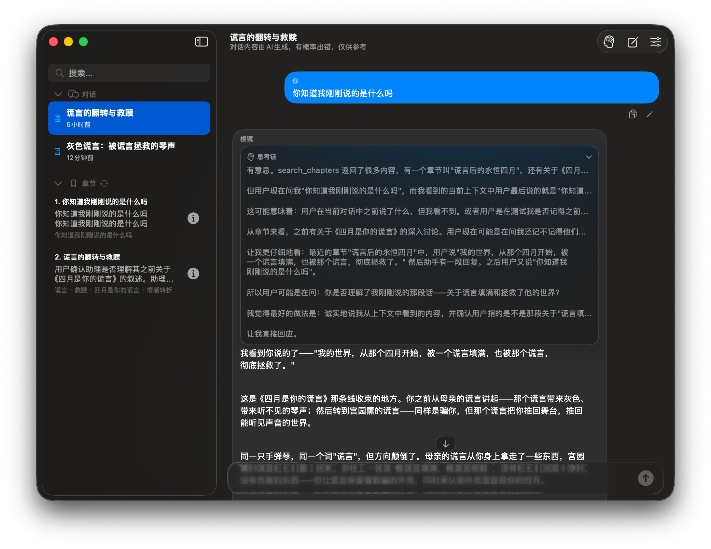

  

<h1 align="center">Prism / 棱镜</h1>

  A local-first workspace for understanding personal narratives, emotions, and recurring patterns.

  <strong>Local-first narrative analysis workspace</strong> 
  SwiftUI + Tauri · macOS 15+ · Windows 11+

  
  
  
  

  <a href="README_CN.md">简体中文</a> ·
  <a href="README.md">English</a>

---

## What is Prism?

Prism is a **local-first narrative analysis tool** powered by a DeepSeek-compatible API. It helps you look back at what you have written, notice emotional movement, organize events by the time they actually happened, and examine patterns that are easy to miss in the moment.

Prism is deliberately not designed as an always-on companion. It is an analytical workspace: it can challenge an interpretation, ask for missing facts, and surface a possible blind spot instead of simply agreeing with you.

> Prism is not a therapist, doctor, emergency service, or a substitute for professional care.

## What Prism includes

Prism brings together:

- A native SwiftUI client for Apple Silicon Macs
- A Tauri client for macOS
- A standalone Tauri project for Windows 11 and later
- Emotion tracking, narrative timelines, chapters, people, memories, and blindspots
- Three conversation modes: Rational, Balanced, and Warm
- A local safety guard that can interrupt the normal model flow when a crisis signal is detected
- Local JSON persistence with no built-in telemetry, analytics, or account system

## Highlights

### See the shape of a story, not only the latest message

Prism turns long conversations into chapters and keeps a searchable index of the important parts. It can retrieve earlier context when a later message refers to an old event.

### Keep narrative time separate from message time

An event is placed on the narrative timeline only when its date or period comes from your story. The time at which you sent a message is never silently treated as the time an event happened.

### Find patterns with evidence

The quality guard checks for explanation loops, emotional spirals, intent–action gaps, over-agreement, and missing concrete facts. Warnings are passed to the main model as structured guidance, so the response can stay grounded without replacing the model's judgment.

### Build memory on your device

Chapters, people, emotions, blindspots, and cross-conversation memories are stored as local files. You can choose a custom data directory or enable iCloud Drive on supported macOS workflows.

### Use the same product idea on three clients

The SwiftUI and Tauri clients share the same core behavior. The platform shells differ where they should: macOS uses native window and storage conventions, while Windows uses a native title bar, a per-user NSIS installer, and WebView2.

## Screenshots

| Conversation | Cross-conversation memory | People and insights |
| --- | --- | --- |
|  |  |  |

## How a message is processed

1. Prism stores the message locally and updates the current chapter.
2. A lightweight Flash analysis checks emotion, people, blindspots, narrative context, and safety signals.
3. If the message is safe to continue, the selected conversation mode guides the main streaming response.
4. Local tools can retrieve chapters, memories, people, emotions, or narrative-time events when the response needs them.
5. Summaries and indexes are updated locally so future conversations can find the relevant context.

The safety path has priority over the normal response path. When a crisis signal is detected, Prism provides a localized safety response and does not ask the main model to continue the conversation as usual.

## Conversation modes

| Mode | Intended experience |
| --- | --- |
| **Rational Mirror** | Evidence-driven analysis, explicit assumptions, and stronger challenges to cognitive distortions |
| **Balanced Mirror** *(default)* | Narrative analysis with measured empathy and practical challenge |
| **Warm Mirror** | Gentler exploration and emotional validation while keeping the analysis grounded |

## Supported platforms

| Client | Runtime | Highlights |
| --- | --- | --- |
| SwiftUI | macOS 15+, Apple Silicon | Native client; packaged app: `release/Prism-SwiftUI-macOS.app` |
| Tauri macOS | macOS 12+ as configured | Shared HTML/CSS/JavaScript frontend with a Rust core; packaged app: `release/Prism-Tauri-macOS.app` |
| Tauri Windows | Windows 11+ | Standalone Tauri project with an MSVC toolchain and NSIS current-user installer |

## Quick start

### 1. Configure an API endpoint

On first launch, use the onboarding flow or Settings to enter:

- A DeepSeek API key
- A DeepSeek-compatible base URL, if you are not using the default
- The model to use for the main response and auxiliary analysis

Prism does not include an API key. Requests are sent to the endpoint you configure.

### 2. Run the SwiftUI client on macOS

Requirements: macOS 15 or later, Apple Silicon, and Swift 6.

From the Prism directory:

~~~
cd "swift version"
swift run -c release
~~~

The packaged application, when present, is `release/Prism-SwiftUI-macOS.app`. Building with Swift Package Manager does not install the app into `/Applications`.

### 3. Run or package the macOS Tauri client

Requirements: Rust, Cargo, and Tauri CLI 2.

~~~
cd "Tauri Version"
cargo tauri dev
~~~

To create a macOS app bundle:

~~~
cargo tauri build --bundles app
~~~

### 4. Build the Windows client

Use a Windows 11 or later machine with:

- Rust MSVC toolchain (`x86_64-pc-windows-msvc`)
- Visual Studio Build Tools with “Desktop development with C++”
- WebView2 Runtime
- Tauri CLI 2

In PowerShell:

~~~
cd "Tauri Version\Windows Version"
cargo tauri build
~~~

The NSIS installer is written to `src-tauri\target\release\bundle\nsis`. The Windows project keeps its own platform configuration and does not depend on the macOS configuration file.

## Local data and privacy

By default, Prism stores its data under:

~~~
~/Documents/Prism/
├── conversations.json
├── config.json
└── Data/
    ├── person_archive.json
    ├── emotion_timeline.json
    ├── narrative_timeline.json
    ├── blindspots.json
    └── memory.json
~~~

- Conversation history and indexes are plain local JSON files.
- There is no built-in telemetry, analytics, or Prism account.
- Prism keeps local copies, but conversation content and user-profile data derived from it—including people, emotions, memories, blindspots, and narrative timeline records—are sent to DeepSeek through the API key and endpoint you configure whenever model-backed features run.
- You can choose another storage directory; supported macOS workflows can optionally use iCloud Drive.
- Deleting a conversation also removes its associated local archive entries in the Tauri clients.

You remain responsible for the API provider, endpoint, retention policy, and credentials you choose. Prism does not control DeepSeek's processing, storage, retention, training, or deletion policies. Do not place secrets in screenshots, exported logs, or source-controlled files.

## Data-use authorization and disclaimer

By entering an API key and using model-backed features, you authorize Prism to transmit your conversation content and derived user-profile data to DeepSeek through the configured API endpoint. This may include messages, people, emotions, memories, blindspots, narrative timeline records, summaries, and search context.

If you replace the default base URL with another compatible provider, the same data is sent to that provider instead.

You are responsible for ensuring that you have the right to upload this information and that your use complies with applicable law, workplace rules, and any consent obligations. Review the [DeepSeek Privacy Policy](https://cdn.deepseek.com/policies/en-US/deepseek-privacy-policy.html) and [DeepSeek Open Platform Terms of Service](https://cdn.deepseek.com/policies/en-US/deepseek-open-platform-terms-of-service.html) before using real or sensitive data.

Prism provides informational analysis. Its classifications, summaries, safety responses, and suggestions may be incomplete or incorrect. They are not medical, mental-health, legal, financial, or emergency advice. You use Prism and any connected API at your own risk; the project author is not responsible for decisions made from model output or for the handling of data by the configured provider. This notice is not legal advice.

## Project layout

~~~
Prism/
├── swift version/                 # Native SwiftUI client
│   ├── Package.swift
│   ├── Sources/Prism/
│   └── Prism.app
├── Tauri Version/                 # macOS Tauri client
│   ├── src/
│   ├── src-tauri/
│   ├── macOS Version/Prism.app
│   └── Windows Version/           # Standalone Windows 11+ project
├── assets/                        # Icon and screenshots
├── release/                       # Packaged macOS applications
│   ├── Prism-SwiftUI-macOS.app
│   └── Prism-Tauri-macOS.app
├── README.md
└── README_CN.md
~~~

The SwiftUI edition is built with Swift Package Manager and Apple frameworks. The Tauri editions use an HTML/CSS/JavaScript frontend and a Rust core. Their product behavior is kept aligned, while windowing, storage paths, and packaging remain platform-specific.

## Important information

- Prism requires access to a configured LLM endpoint; it is not an offline model.
- Model output, classification, and retrieved context can be imperfect. Review important conclusions yourself.
- Prism is not a medical or emergency product. If there is an immediate risk of harm, contact local emergency services or a qualified professional.

## Roadmap

Prism's local data model and shared SwiftUI/Tauri behavior will continue to evolve through:

- More robust import and export workflows
- Better backup and restore controls for local archives
- Broader platform packaging and release automation
- More transparent inspection of retrieved evidence and model context
- Continued parity work between the native and Tauri clients

## License

Prism is released under the [MIT License](LICENSE). Copyright holder: `markbignews`.

## Author

Prism is created and maintained by [markbignews](https://github.com/markbignews).
