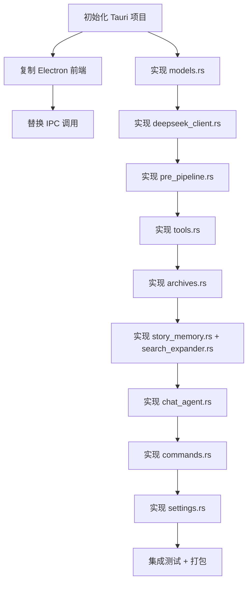

# Prism — Tauri 迁移方案

## 策略

- **架构参考** macOS Swift 版 (协议 + 值类型 + 管道分离)
- **前端复用** Electron 版 (HTML/CSS/JS 直接搬)
- **后端新写** Rust (对应 Swift 版 `ChatAgent` + `ChatStore` 架构)

---

## 一、架构对应关系

### 数据模型 (Models)

Swift `Models.swift`  →  Rust `src/models.rs`

| Swift | Rust | Electron 复用 |
|-------|------|---------------|
| `ChatMessage` | `struct ChatMessage` | — |
| `Conversation` | `struct Conversation` | — |
| `StoryChapter` | `struct StoryChapter` | — |
| `EmotionEntry` | `struct EmotionEntry` | — |
| `PersonRecord` | `struct PersonRecord` | — |
| `BlindspotRecord` | `struct BlindspotRecord` | — |
| `MemoryEntry` | `struct MemoryEntry` | — |
| `ToolCall` | `struct ToolCall` | — |
| `ConversationMode` | `enum ConversationMode` | — |
| `ResponseLength` | `enum ResponseLength` | — |
| `AppLanguage` | `enum AppLanguage` | — |
| `ModelParameters` | `struct ModelParameters` | — |

所有模型统一用 `serde::Serialize + Deserialize`，JSON 格式与 Swift/Electron 版本**完全兼容**，三个版本可互换数据目录。

### 状态管理 (Store)

Swift `ChatStore` + `ChatAgent`  →  Rust `src/chat_agent.rs`

```
Swift: ChatAgent (业务) ← ChatStore (ObservableObject, View 层)
                                    ↓
Rust:  ChatAgent (状态 + 业务, Arc<RwLock<>>) ← Tauri State (前端通过 invoke)
```

### 设置管理

Swift `AppSettings`  →  Rust `src/settings.rs`

与 Electron `settings.json` / Swift `config.json` 字段兼容。

### 流式通信

```
Electron:  main.js IPC handler → ipcRenderer.on('msg:event', ...)
Tauri:     #[tauri::command] → app_handle.emit("msg:event", payload)
           前端: listen("msg:event", callback)
```

### 管道架构 (Pipeline)

参照 Swift 版严格三层分离：

```
Swift:  ChatAgent.send()
           ├── StoryMemory.ingest()         ← 上下文记忆
           ├── PrePipeline.run()             ← Flash 模型 (守卫 + 情感提取)
           ├── Main Model Loop (Pro)         ← 流式 + 工具调用 (最多 3 轮)
           └── Post-processing               ← 归档 + 摘要
```

---

## 二、前端复用方案

### 继承的代码

| Electron 文件 | 行数 | 复用方式 |
|--------------|------|---------|
| `renderer/index.html` | ~886 | **直接复制** → `Tauri/src/index.html`，改 `<script>` 路径 |
| `renderer/app.js` | ~2252 | **直接复制** → `Tauri/src/app.js`，替换 IPC 调用 |
| `index.html` 中 CSS 变量 | ~64行 | **保留**，亮/暗主题已完备 |
| `icon.png` | — | **复制** → `Tauri/app-icons/` |

### 需要修改的前端代码

#### IPC 调用替换表

| Electron `window.api.xxx` | Tauri `invoke('xxx')` |
|--------------------------|----------------------|
| `createConversation(mode)` | `invoke('create_conversation', { mode })` |
| `deleteConversation(id)` | `invoke('delete_conversation', { id })` |
| `deleteMessagePair(convId, idx)` | `invoke('delete_message_pair', { convId, idx })` |
| `listConversations()` | `invoke('list_conversations')` |
| `getConversation(id)` | `invoke('get_conversation', { id })` |
| `setMode(convId, mode)` | `invoke('set_mode', { convId, mode })` |
| `setTitle(convId, title)` | `invoke('set_title', { convId, title })` |
| `sendMessage(convId, text)` | `invoke('send_message', { convId, text })` |
| `cancelMessage()` | `invoke('cancel_message')` |
| `onMessageEvent(callback)` | `listen('msg:event', callback)` |
| ... | ... |

#### 入口文件改动

在 `index.html` 的 `<head>` 中添加 Tauri 必备：

```html
<script type="module">
  import { invoke } from '@tauri-apps/api/core'
  import { listen } from '@tauri-apps/api/event'
  window.invoke = invoke
  window.listen = listen
</script>
```

然后在 `app.js` 中将所有 `window.api.xxx(...)` 替换为 `invoke('xxx', ...)`，`window.api.onMessageEvent` 替换为 `listen('msg:event', ...)`。

---

## 三、目录结构

```
Prism/Tauri Version/
├── Cargo.toml                 # Rust 项目 + Tauri 依赖
├── tauri.conf.json            # Tauri 配置 (窗口大小、标题、权限、图标)
├── capabilities/              # Tauri v2 权限声明
│   └── default.json
├── src/                       # ─── Rust 后端 ───
│   ├── main.rs                # 入口: Tauri Builder + commands 注册
│   ├── commands.rs            # 所有 #[tauri::command] 函数 (≈ Electron main.js IPC)
│   ├── models.rs              # 数据模型 (≈ Swift Models.swift)
│   ├── settings.rs            # 设置管理 (≈ Swift AppSettings.swift)
│   ├── chat_agent.rs          # 核心编排 (≈ Swift ChatAgent.swift + ChatStore.swift)
│   ├── deepseek_client.rs     # DeepSeek API (≈ Swift DeepSeekClient.swift)
│   ├── pre_pipeline.rs        # Flash 模型前置管道 (≈ Swift PrePipeline.swift)
│   ├── tools.rs               # 5 个检索工具 (≈ Swift Tools.swift)
│   ├── archives.rs            # JSON 持久化 (≈ Swift 内嵌 localStorage)
│   ├── search_expander.rs     # 同义词扩展 (≈ Swift SearchExpander.swift)
│   ├── story_memory.rs        # 章节记忆 (≈ Swift StoryMemory.swift)
│   └── prompts.rs             # 系统提示词 (≈ Swift AgentPrompt.swift)
│
├── src-tauri/                 # Tauri 编译产物目录 (由 tauri init 生成)
│
├── src/                       # ─── 前端 (从 Electron 继承) ───
│   ├── index.html             # 入口 HTML + CSS 变量
│   ├── app.js                 # 全部 UI 逻辑 (替换 IPC 调用)
│   └── styles.css             # (可选拆分, 也可留在 index.html 的 <style> 中)
│
├── app-icons/                 # 应用图标
│   ├── icon.png
│   ├── icon.ico
│   └── ...
│
├── README.md
└── MIGRATION_PLAN.md          # 本文档
```

---

## 四、Rust 后端模块职责

| 模块 | 对应 Swift | 对应 Electron | 关键依赖 |
|------|-----------|--------------|---------|
| `main.rs` | `PrismApp.swift` | `main.js` | tauri |
| `commands.rs` | 无 (SwiftUI 直接调用) | `main.js` IPC handlers | tauri::command |
| `models.rs` | `Models.swift` | `archives.js` 数据结构 | serde |
| `settings.rs` | `AppSettings.swift` | `main.js` settings:get/save | serde_json, tokio::fs |
| `chat_agent.rs` | `ChatAgent.swift` + `ChatStore.swift` | `chatagent.js` | tokio |
| `deepseek_client.rs` | `DeepSeekClient.swift` | `deepseek.js` | reqwest, eventsource-stream |
| `pre_pipeline.rs` | `PrePipeline.swift` | `prepipeline.js` | — |
| `tools.rs` | `Tools.swift` | `tools.js` | — |
| `archives.rs` | (内嵌在 ChatAgent) | `archives.js` | serde_json, tokio::fs |
| `search_expander.rs` | `SearchExpander.swift` | (内嵌在 chatagent.js) | — |
| `story_memory.rs` | `StoryMemory.swift` | (内嵌在 chatagent.js) | — |
| `prompts.rs` | `AgentPrompt.swift` | `prompts.js` | — |

---

## 五、流式 SSE 处理

Electron 的 `ReadableStream.getReader()`  →  Rust 的 `reqwest::Response::bytes_stream()`

```
Electron:                                              Tauri:
──────────────────────────────                         ──────────────────────────────
fetch(url, {stream: true})                             reqwest::Client::post(url)
  .body → reader.read()                                  .body → response.bytes_stream()
  → parse SSE lines                                      → pin_mut!().for_each(|chunk|
  → callback({type, data})                                  → parse SSE lines
                                                           → app_handle.emit("msg:event", payload)
                                                             └── 前端 listen("msg:event")
```

Rust 端用 `eventsource-stream` 或手动解析 SSE `data:` 行。

---

## 六、数据迁移

已有 Electron / macOS 用户数据可直接迁移：

| 文件 | 路径 |
|------|------|
| `conversations.json` | `<dataPath>/conversations.json` |
| `emotion_timeline.json` | `<dataPath>/Data/emotion_timeline.json` |
| `person_archive.json` | `<dataPath>/Data/person_archive.json` |
| `blindspots.json` | `<dataPath>/Data/blindspots.json` |
| `memory.json` | `<dataPath>/Data/memory.json` |
| `config.json` / `settings.json` | `<dataPath>/config.json` |

数据格式在三个版本中**完全一致**（JSON 字段名相同），Tauri 直接读取即用。

---

## 七、实施步骤



推荐顺序：

```
第一阶段 (1-2天):   Tauri 项目初始化 + 前端迁移 (HTML/CSS/JS)
第二阶段 (3-7天):   Rust 后端核心 (models + deepseek_client + archives + prompts)
第三阶段 (3-5天):   管道实现 (pre_pipeline + tools + story_memory + chat_agent)
第四阶段 (2-3天):   命令绑定 (commands + settings) + IPC 对接
第五阶段 (2-3天):   集成测试 + CI + 打包
合计: ~12-20 人天
```
