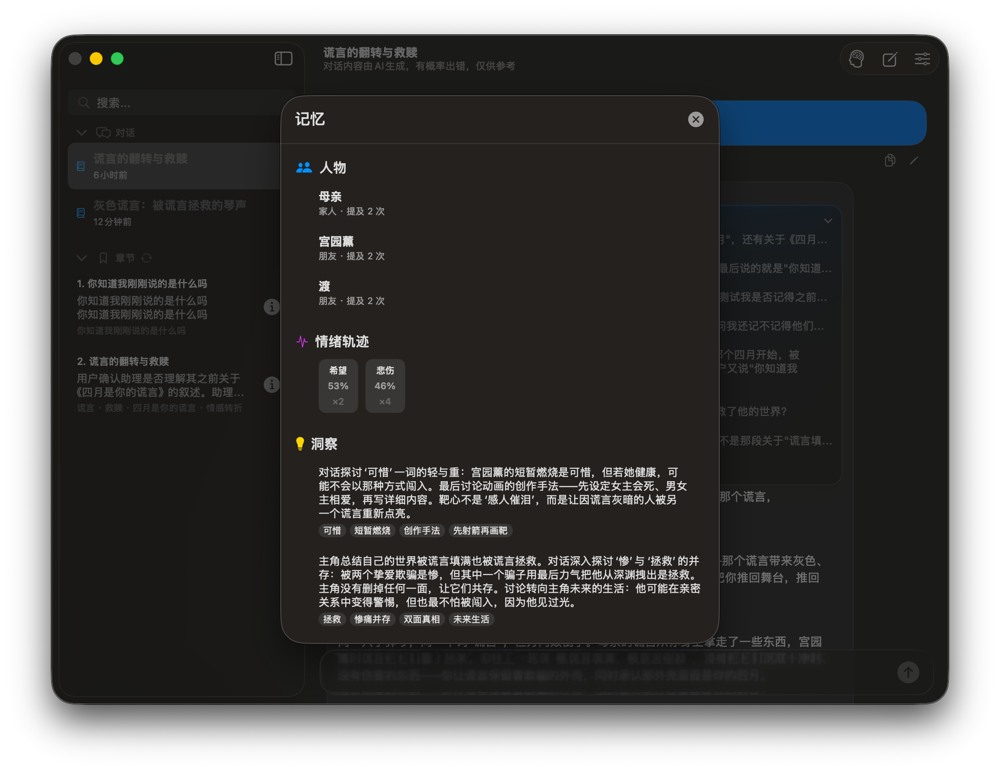

<p align="center">
  
</p>

<p align="center">
  <strong>稜鏡 / Prism</strong><br>
  敘事分析 Agent · Narrative Analysis Agent<br>
</p>

<p align="center">
  
  
</p>

<p align="center">
  <a href="README.md">English</a> · <a href="README_CN.md">简体中文</a> · <a href="README_ZH_HANT.md">繁體中文</a>
</p>

---

稜鏡是一款**本地優先、尊重隱私**的敘事分析 Agent，基於 DeepSeek 大語言模型。它識別敘事模式、追蹤情緒變化、發現盲點。

> 本產品係敘事分析 Agent，不屬於《人工智能擬人化互動服務管理暫行辦法》(2026.7.15施行) 所規定的"擬人化互動服務"。不提供持續性情感陪伴。未滿14周歲請在監護人陪同下使用。

---

### 截圖

| 對話 | 跨對話記憶 | 人物記憶 |
|---|---|---|
|  |  |  |

---

## 版本

| 版本 | 平台 | 技術棧 |
|---|---|---|
| **macOS Version** | macOS 15+ | SwiftUI + Swift Agent (嵌入式) |
| **Windows Version** | Windows 10+ | WinUI 3 + C# Agent (嵌入式) |

---

## 建置

```bash
cd "macOS Version" && swift build -c release
```

零第三方依賴，僅需 Swift 6.0+。

---

## 隱私

100% 本地儲存 · 僅當前上下文發 API · 無遙測

---

## 授權

[MIT](LICENSE)

---

*稜鏡不是來留住你的，是來幫你離開的。*
